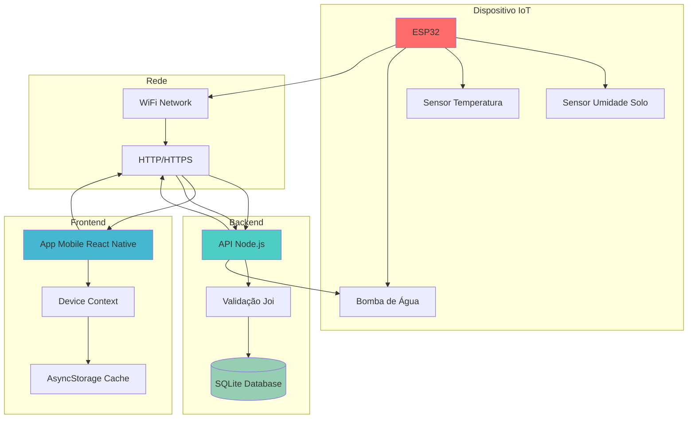
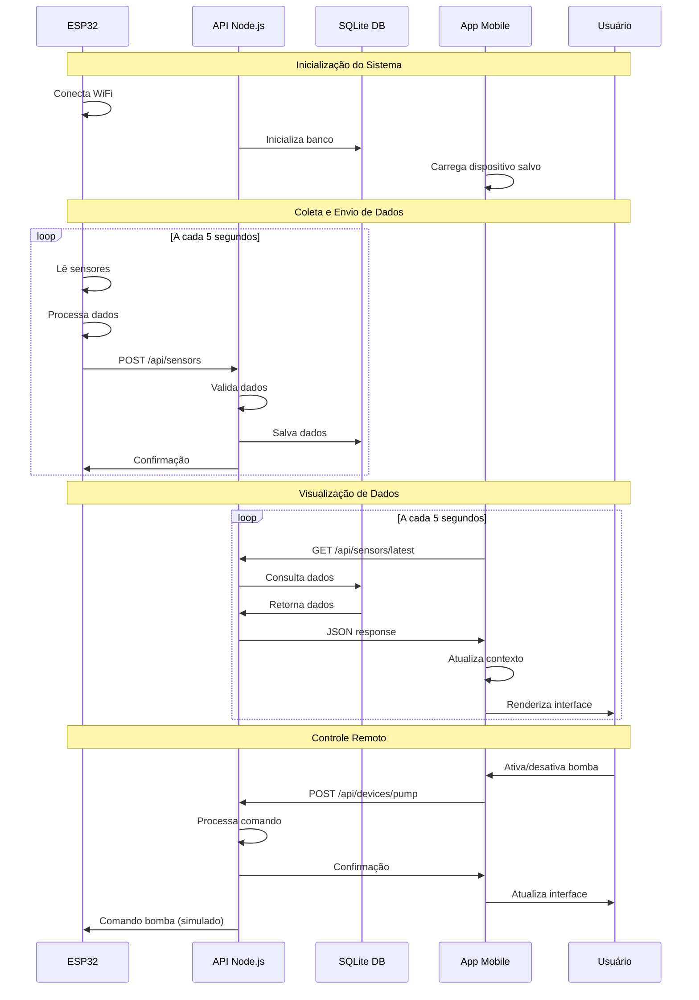
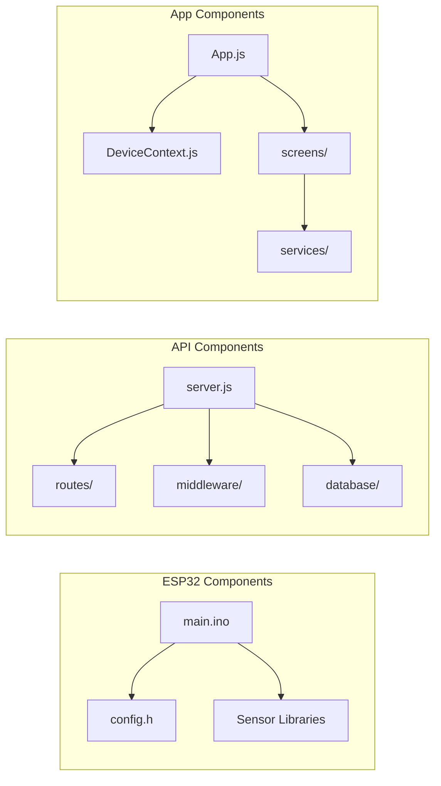
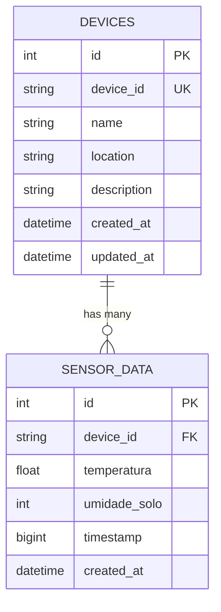
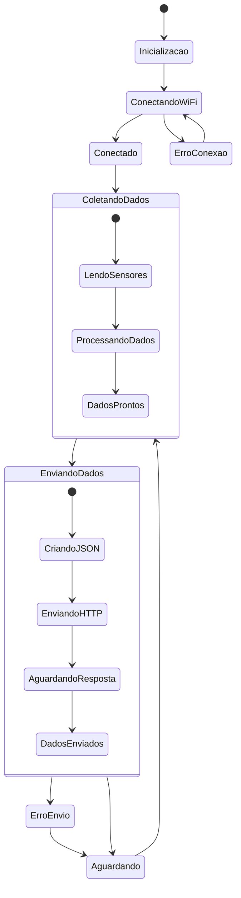
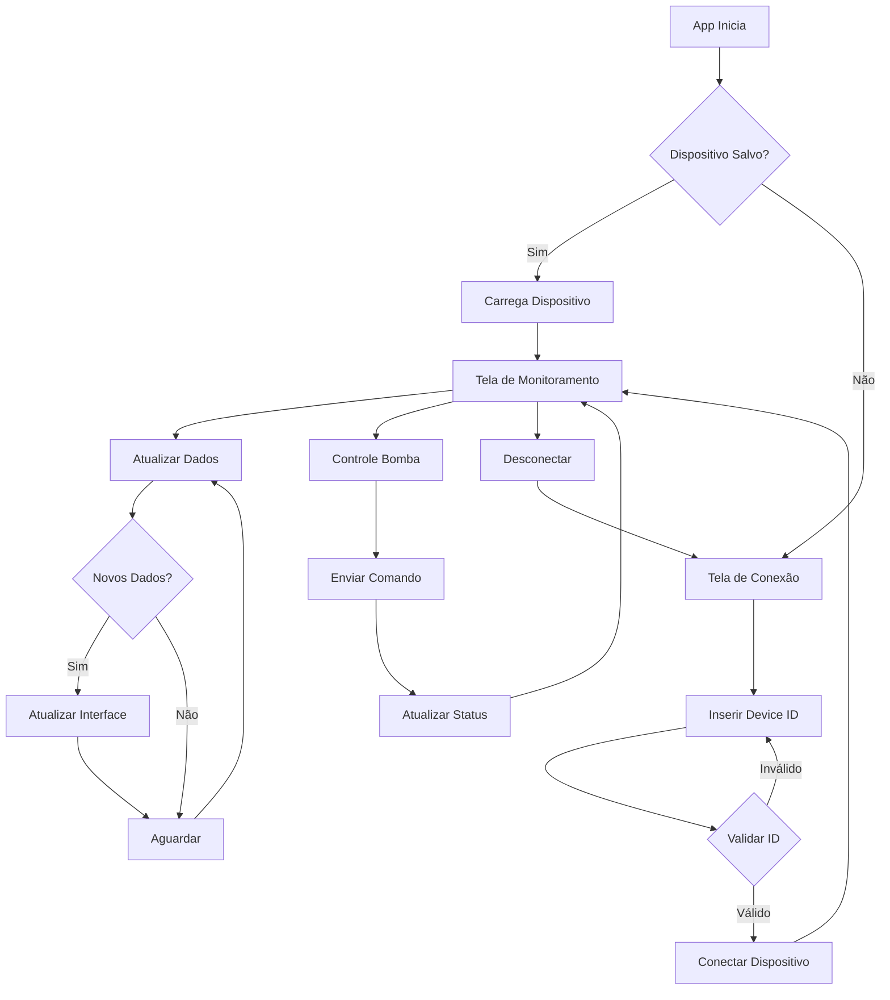
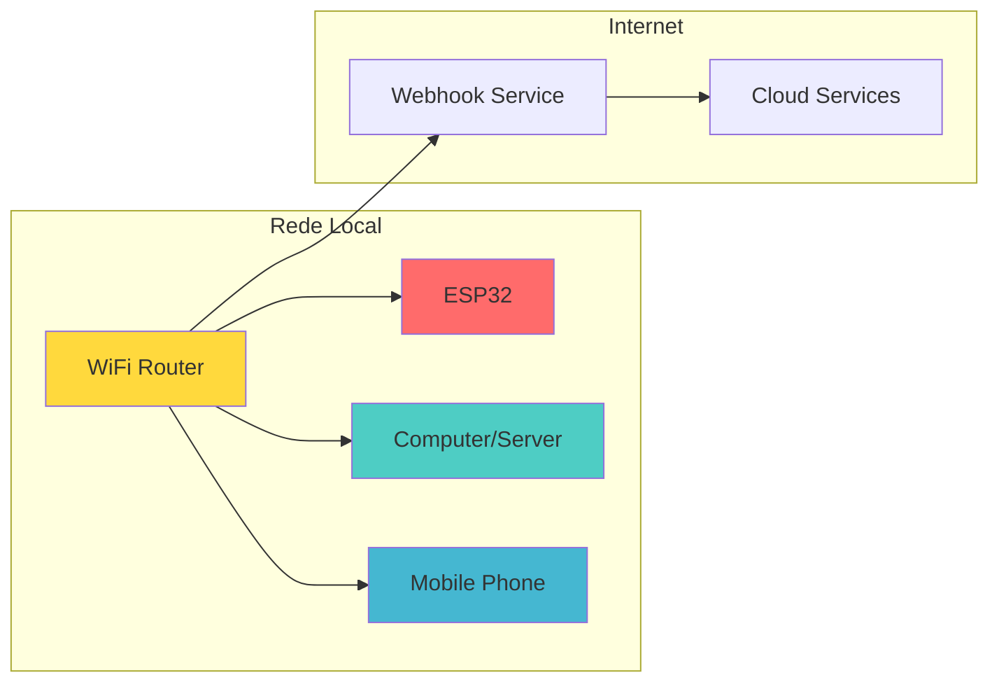
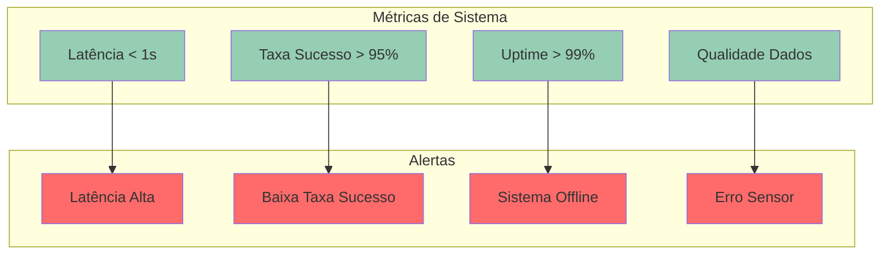
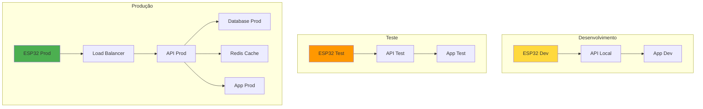

# 📊 Diagramas do Sistema - Monitoramento ESP32

## 🔄 Diagrama de Arquitetura Geral

## 🔄 Fluxo de Dados Detalhado

## 🏗️ Estrutura de Componentes

## 📊 Estrutura do Banco de Dados

## 🔄 Estados do Sistema

## 📱 Fluxo do Aplicativo Mobile

## 🔧 Configuração de Rede

## 📈 Monitoramento de Performance

## 🚀 Deploy e Escalabilidade

---

**Diagramas criados com Mermaid! 📊** 